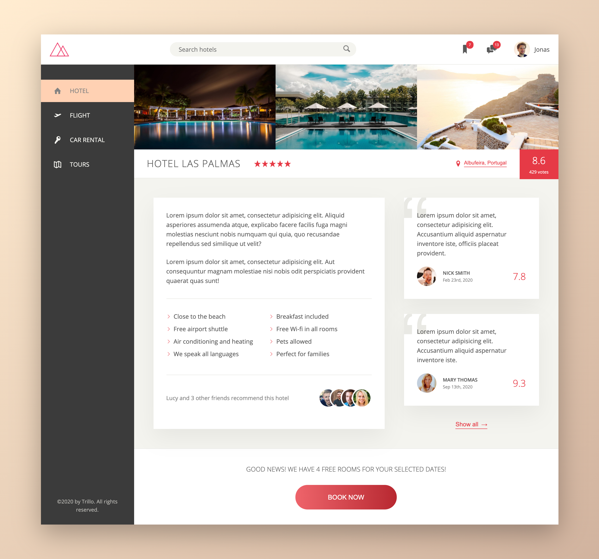

# Training projects "Trillo" - a travel agency website

[Demo](https://vannyle.github.io/trillo/)

---

The project was built on Flexbox with BEM, Sass, Gulp.

Created while attending course «[Advanced CSS and Sass: Flexbox, Grid, Animation and more](https://www.udemy.com/course/advanced-css-and-sass/)» from Jonas Schmedtmann.

---

### Images

